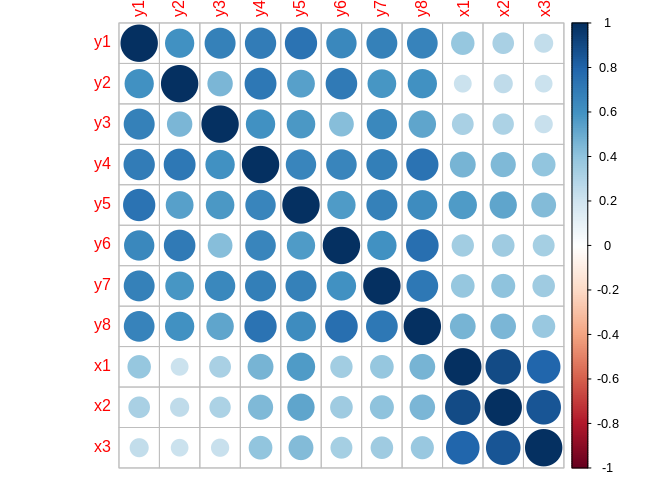

Gently Introdcution to Structural Equation Modeling with Lavaan
================

-   [Summary](#summary)
-   [References](#references)
-   [Further readings](#further-readings)

**Overview**

``` r
library(lavaan)
```

    ## This is lavaan 0.6-2

    ## lavaan is BETA software! Please report any bugs.

``` r
library(tidyverse)
```

    ## ── Attaching packages ───────────────────────────────────────────────────────────────────────── tidyverse 1.2.1 ──

    ## ✔ ggplot2 3.0.0     ✔ purrr   0.2.5
    ## ✔ tibble  1.4.2     ✔ dplyr   0.7.6
    ## ✔ tidyr   0.8.1     ✔ stringr 1.3.1
    ## ✔ readr   1.1.1     ✔ forcats 0.3.0

    ## ── Conflicts ──────────────────────────────────────────────────────────────────────────── tidyverse_conflicts() ──
    ## ✖ dplyr::filter() masks stats::filter()
    ## ✖ dplyr::lag()    masks stats::lag()

``` r
glimpse(PoliticalDemocracy)
```

    ## Observations: 75
    ## Variables: 11
    ## $ y1 <dbl> 2.50, 1.25, 7.50, 8.90, 10.00, 7.50, 7.50, 7.50, 2.50, 10.0...
    ## $ y2 <dbl> 0.000000, 0.000000, 8.800000, 8.800000, 3.333333, 3.333333,...
    ## $ y3 <dbl> 3.333333, 3.333333, 9.999998, 9.999998, 9.999998, 6.666666,...
    ## $ y4 <dbl> 0.000000, 0.000000, 9.199991, 9.199991, 6.666666, 6.666666,...
    ## $ y5 <dbl> 1.250000, 6.250000, 8.750000, 8.907948, 7.500000, 6.250000,...
    ## $ y6 <dbl> 0.000000, 1.100000, 8.094061, 8.127979, 3.333333, 1.100000,...
    ## $ y7 <dbl> 3.726360, 6.666666, 9.999998, 9.999998, 9.999998, 6.666666,...
    ## $ y8 <dbl> 3.333333, 0.736999, 8.211809, 4.615086, 6.666666, 0.368500,...
    ## $ x1 <dbl> 4.442651, 5.384495, 5.961005, 6.285998, 5.863631, 5.533389,...
    ## $ x2 <dbl> 3.637586, 5.062595, 6.255750, 7.567863, 6.818924, 5.135798,...
    ## $ x3 <dbl> 2.557615, 3.568079, 5.224433, 6.267495, 4.573679, 3.892270,...

| variable | what is it? | range |
|----------|-------------|-------|
| y1       |             |       |
| y2       |             |       |

``` r
library(corrplot)
```

    ## corrplot 0.84 loaded

``` r
corrplot(cor(PoliticalDemocracy))
```



``` r
model <- '
  # measurement model
    ind60 =~ x1 + x2 + x3
    dem60 =~ y1 + y2 + y3 + y4
    dem65 =~ y5 + y6 + y7 + y8
  # regressions
    dem60 ~ ind60
    dem65 ~ ind60 + dem60
  # residual correlations
    y1 ~~ y5
    y2 ~~ y4 + y6
    y3 ~~ y7
    y4 ~~ y8
    y6 ~~ y8
'

fit <- sem(model, data=PoliticalDemocracy)
summary(fit, standardized=TRUE) 
```

    ## lavaan 0.6-2 ended normally after 68 iterations
    ## 
    ##   Optimization method                           NLMINB
    ##   Number of free parameters                         31
    ## 
    ##   Number of observations                            75
    ## 
    ##   Estimator                                         ML
    ##   Model Fit Test Statistic                      38.125
    ##   Degrees of freedom                                35
    ##   P-value (Chi-square)                           0.329
    ## 
    ## Parameter Estimates:
    ## 
    ##   Information                                 Expected
    ##   Information saturated (h1) model          Structured
    ##   Standard Errors                             Standard
    ## 
    ## Latent Variables:
    ##                    Estimate  Std.Err  z-value  P(>|z|)   Std.lv  Std.all
    ##   ind60 =~                                                              
    ##     x1                1.000                               0.670    0.920
    ##     x2                2.180    0.139   15.742    0.000    1.460    0.973
    ##     x3                1.819    0.152   11.967    0.000    1.218    0.872
    ##   dem60 =~                                                              
    ##     y1                1.000                               2.223    0.850
    ##     y2                1.257    0.182    6.889    0.000    2.794    0.717
    ##     y3                1.058    0.151    6.987    0.000    2.351    0.722
    ##     y4                1.265    0.145    8.722    0.000    2.812    0.846
    ##   dem65 =~                                                              
    ##     y5                1.000                               2.103    0.808
    ##     y6                1.186    0.169    7.024    0.000    2.493    0.746
    ##     y7                1.280    0.160    8.002    0.000    2.691    0.824
    ##     y8                1.266    0.158    8.007    0.000    2.662    0.828
    ## 
    ## Regressions:
    ##                    Estimate  Std.Err  z-value  P(>|z|)   Std.lv  Std.all
    ##   dem60 ~                                                               
    ##     ind60             1.483    0.399    3.715    0.000    0.447    0.447
    ##   dem65 ~                                                               
    ##     ind60             0.572    0.221    2.586    0.010    0.182    0.182
    ##     dem60             0.837    0.098    8.514    0.000    0.885    0.885
    ## 
    ## Covariances:
    ##                    Estimate  Std.Err  z-value  P(>|z|)   Std.lv  Std.all
    ##  .y1 ~~                                                                 
    ##    .y5                0.624    0.358    1.741    0.082    0.624    0.296
    ##  .y2 ~~                                                                 
    ##    .y4                1.313    0.702    1.871    0.061    1.313    0.273
    ##    .y6                2.153    0.734    2.934    0.003    2.153    0.356
    ##  .y3 ~~                                                                 
    ##    .y7                0.795    0.608    1.308    0.191    0.795    0.191
    ##  .y4 ~~                                                                 
    ##    .y8                0.348    0.442    0.787    0.431    0.348    0.109
    ##  .y6 ~~                                                                 
    ##    .y8                1.356    0.568    2.386    0.017    1.356    0.338
    ## 
    ## Variances:
    ##                    Estimate  Std.Err  z-value  P(>|z|)   Std.lv  Std.all
    ##    .x1                0.082    0.019    4.184    0.000    0.082    0.154
    ##    .x2                0.120    0.070    1.718    0.086    0.120    0.053
    ##    .x3                0.467    0.090    5.177    0.000    0.467    0.239
    ##    .y1                1.891    0.444    4.256    0.000    1.891    0.277
    ##    .y2                7.373    1.374    5.366    0.000    7.373    0.486
    ##    .y3                5.067    0.952    5.324    0.000    5.067    0.478
    ##    .y4                3.148    0.739    4.261    0.000    3.148    0.285
    ##    .y5                2.351    0.480    4.895    0.000    2.351    0.347
    ##    .y6                4.954    0.914    5.419    0.000    4.954    0.443
    ##    .y7                3.431    0.713    4.814    0.000    3.431    0.322
    ##    .y8                3.254    0.695    4.685    0.000    3.254    0.315
    ##     ind60             0.448    0.087    5.173    0.000    1.000    1.000
    ##    .dem60             3.956    0.921    4.295    0.000    0.800    0.800
    ##    .dem65             0.172    0.215    0.803    0.422    0.039    0.039

Summary
-------

References
----------

Bollen, K. A. (1989). Structural Equations with Latent Variables. Wiley Series in Probability and Mathematical Statistics. New York: Wiley. Bollen, K. A. (1979). Political democracy and the timing of development. American Sociological Review, 44, 572-587. Bollen, K. A. (1980). Issues in the comparative measurement of political democracy. American Sociological Review, 45, 370-390.

Further readings
----------------
